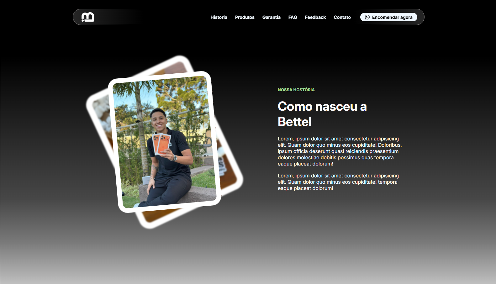

# Bettel Imports - Landing

The Bettel Imports landing page is a site showcasing Apple products, designed to capture leads from new customers and increase sales volume.
---

## Project status

>> 🟡 In Development

---

## Project Progress

### Components

| Component | Progress |
| Header | 80% |
| Sidebar | 85% |
| Footer | 10% |
| Notfound | 100% | 

### Pages

| Page | Progress | 
| Hero | 75% |
| About | 100% | 
| Products | 5% | 
| Garantee | 5% |
| FAQ | 0% |
| Feedback | 0% |
| Contact | 0% |

### Responsivity

| Device | Progress | 
| Desktop | 65% |
| Tablet | 25% |
| Mobile | 60% |

---

## Layout

### Desktop

### Mobile

---

### Author

- Pedro Rodrigues de Oliveira
- (Linkedin) [https://www.linkedin.com/in/pedro-rodrigues-de-oliveira-a925533b8/]
- (Instagram) [https://www.instagram.com/eu_cephas/]

### Owner

- [Bettel Imports Instagram](https://www.instagram.com/bettelimports/)