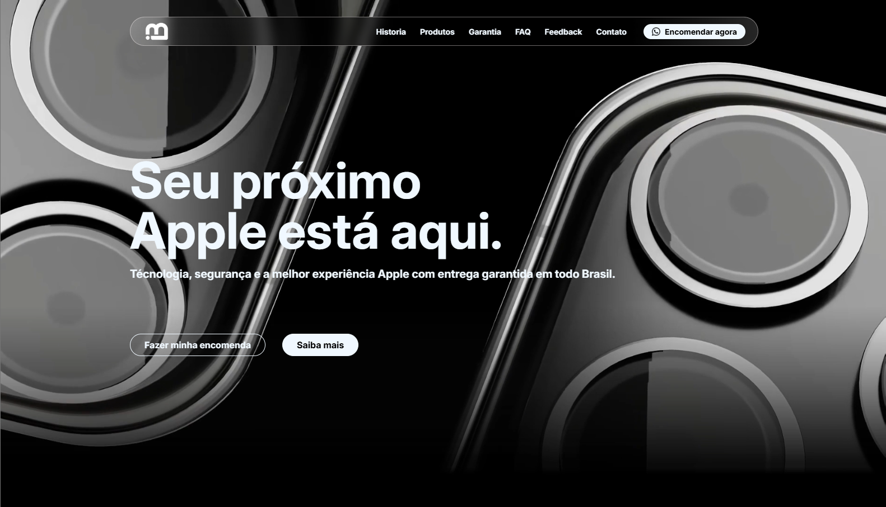
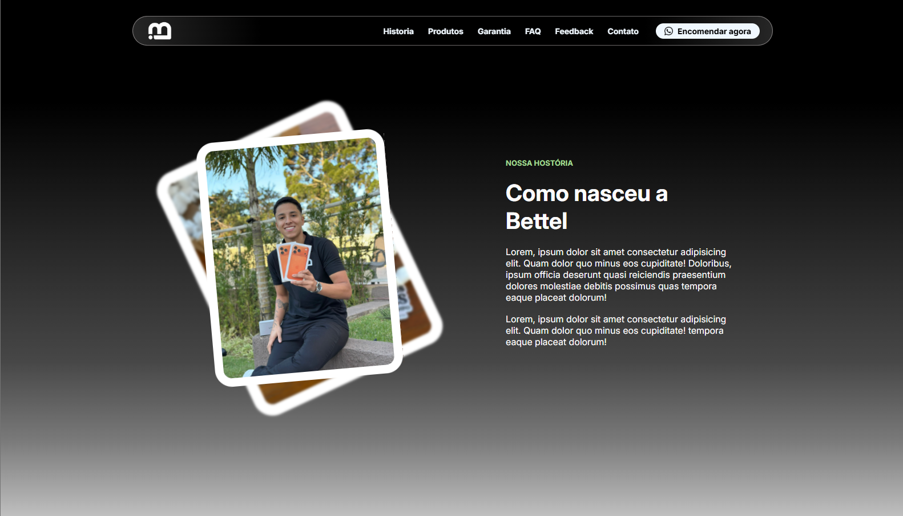
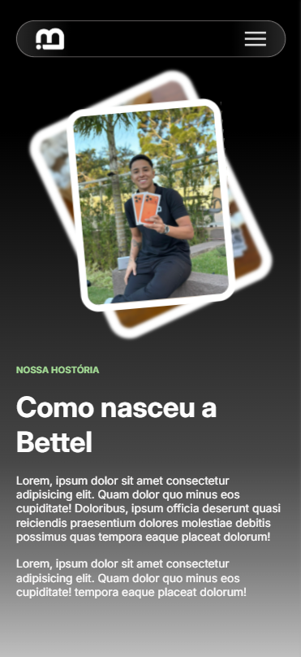

# Bettel Imports — Landing Page

A modern and responsive landing page developed for **Bettel Imports**, focused on showcasing Apple products, generating leads, and increasing sales opportunities.

The project is being developed with a focus on **responsive design, reusable React components, and a clean user experience**.

---

## 🟡 Project Status

**In Development**

---

## 📊 Project Progress

### Components

| Component | Progress |
| --------- | -------: |
| Header    |      95% |
| Sidebar   |      95% |
| Footer    |      10% |
| NotFound  |     100% |

=======

### Pages

| Page       | Progress |
| ---------  | -------: |
| Hero       |     100% |
| About      |     100% |
| Products   |       5% |
| Difference |      55% |
| Feedback   |      95% |
| FAQ        |      95% |
| Contact    |      95% |

### Responsiveness

| Device  | Progress |
| ------- | -------: |
| Desktop |      95% |
| Tablet  |      55% |
| Mobile  |      70% |

---

## 🖥️ Layout

### Desktop

#### Hero

#### About

### Mobile

#### Hero

#### About

#### Sidebar

---

## 👨‍💻 Author

**Pedro Rodrigues de Oliveira**

* [LinkedIn](https://www.linkedin.com/in/pedro-rodrigues-de-oliveira-a925533b8/)
* [Instagram](https://www.instagram.com/eu_cephas/)

---

## 🏪 Owner

**Bettel Imports**

* [Instagram](https://www.instagram.com/bettelimports/)
